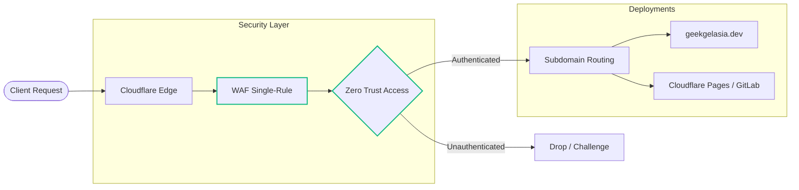

# Geek Gelasia

### code · curiosity · cosmic wonder · humanity · humor

I build small digital things for large questions.

Sometimes they are experiments.
Sometimes they are observations.
Sometimes they are sanctuaries.

Usually, I am trying to find out what happens.




## Currently observing

🧪 What happens when curiosity gets access to code    
🧠 Humans behaving like humans  
🌌 The universe being neither bothered nor explaining itself    
🕸 Systems, emergence, interconnection
🌱 Trees growing slower than my CSS

## Method

```text
notice something new or remember something old
        ↓
ask for its definitions and environmental variables
        ↓
research those until I find all related systems 
        ↓
visualize it LARPing
        ↓
try out its LARP costume 
        ↓
see what happens
        ↓
eat Lunch
```

## Things I'm making

**🌌 Geek Gelasia**  
A digital habitat for experiments in curiosity.

**🪐 Cosmic Wonder**  
Explorations of scale, perspective, science, and the peculiar experience of being a small creature in a very large universe.

**🧪 Machines & experiments**  
Interactive objects for thinking with your hands.

**📜 Artifacts**  
Writing, poetry, observations, and other things that travel down my arm while I am exploring the universe.


## 🦴 The Fossil Record

Things do not usually arrive fully formed. Ideas mutate, interfaces wander, and experiments fail. I keep some of the evidence—not because every version was good, but because becoming is part of the work.

### 📫 Connect: 
cosmicwonder@duck.com | 🔗 GeekGelasia.dev

---

*Still becoming.*

🌌 [Geek Gelasia](https://geekgelasia.dev) · 🪐 [Cosmic Wonder](https://geekgelasia.dev)


graph LR
    A[User Request] --> B[Cloudflare Edge / WAF]
    B --> C{Zero Trust Access}
    C -->|Authenticated| D[Protected Staging / Admin]
    B -->|Public Traffic| E[Cloudflare Pages]


graph TD
    Visitor([Web Visitor]) --> DNS["Cloudflare DNS: geekgelasia.dev"]
    
    DNS --> WAF{"Cloudflare WAF"}
    WAF -->|Blocked by Single-Rule| Drop((Dropped))
    WAF -->|Clean Traffic| Router{"Subdomain Routing"}
    
    Router -->|Main Domain| MainSite["Cloudflare Pages: Production"]
    Router -->|Custom Subdomains| ZT{"Zero Trust Access"}
    
    ZT -->|Authentication Failed| Deny((Denied))
    ZT -->|Authenticated| ProtectedApp["Cloudflare Pages: Restricted"]
    
    Dev([Local Development]) --> Git["GitLab / GitHub Repo"]
    Git -->|Commit & Push| CI["Cloudflare Build Pipeline"]
    CI -.->|Automated Deployment| MainSite
    CI -.->|Automated Deployment| ProtectedApp

