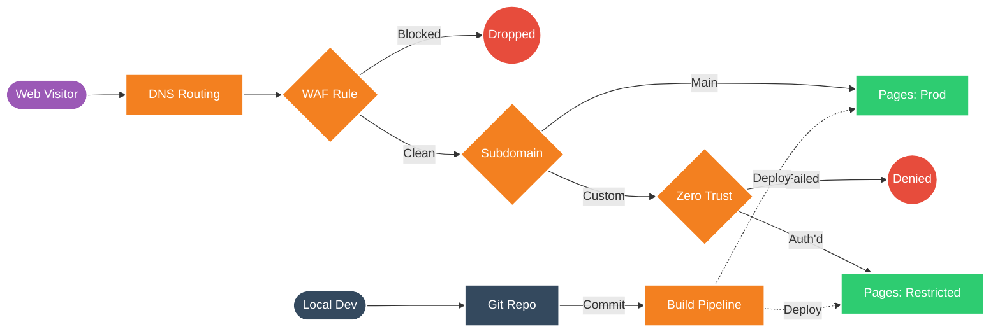

# **Geek Gelasia**

**code · curiosity · cosmic wonder · humanity · humor**

I build small digital things for large questions. As a freelance web developer and digital artist, I build interactive habitats, experiments, and sanctuaries to find out what happens when curiosity gets access to code.

### **🛠️ The Toolkit**

*What I use to build the universe:*

  * **Frontend Architecture:** HTML, CSS, JavaScript, React, Tailwind CSS
  * **Infrastructure & Security:** Cloudflare Pages, Zero Trust access controls, WAF configurations, GitLab
  * **Digital Art & UI:** Zenga abstract aesthetics, sumi-e ink wash illustration, interactive audio-visual components

```mermaid
%%{init: {'themeVariables': { 'fontSize': '16px', 'fontFamily': 'sans-serif'}}}%%
graph LR
    %% Define Custom Colors
    classDef visitor fill:#9b59b6,color:#fff,stroke:#fff,stroke-width:2px
    classDef cloudflare fill:#f38020,color:#fff,stroke:#fff,stroke-width:2px
    classDef secure fill:#2ecc71,color:#fff,stroke:#fff,stroke-width:2px
    classDef blocked fill:#e74c3c,color:#fff,stroke:#fff,stroke-width:2px
    classDef git fill:#34495e,color:#fff,stroke:#fff,stroke-width:2px

    %% Flowchart Nodes
    Visitor([Web Visitor]):::visitor --> DNS["DNS Routing"]:::cloudflare
    
    DNS --> WAF{"WAF Rule"}:::cloudflare
    WAF -->|Blocked| Drop((Dropped)):::blocked
    WAF -->|Clean| Router{"Subdomain"}:::cloudflare
    
    Router -->|Main| MainSite["Pages: Prod"]:::secure
    Router -->|Custom| ZT{"Zero Trust"}:::cloudflare
    
    ZT -->|Failed| Deny((Denied)):::blocked
    ZT -->|Auth'd| ProtectedApp["Pages: Restricted"]:::secure
    
    Dev([Local Dev]):::git --> Git["Git Repo"]:::git
    Git -->|Commit| CI["Build Pipeline"]:::cloudflare
    CI -.->|Deploy| MainSite
    CI -.->|Deploy| ProtectedApp
```

### **🔭 Currently Observing & Building**

  * 🌌 [**Geek Gelasia**](https://geekgelasia.dev):: A digital sanctuary for experiments in contemplative curiosity.
  * 🪐 **Cosmic Wonder:** Explorations of scale, perspective, science, and the peculiar experience of being a small creature in a very large universe. Based on Kepler’s Laws of Planetary Motion:: 🪐 [Orrery Chord](https://keplers-chord.geekgelasia.dev/) ✨
  * 🏛️ **Interactive Artifacts:** Digital demonstrations bridging classical philosophy (like Epictetus's *Enchiridion*) with modern web architecture. *Coming Soon!*
  * 🕸️ **Systems & Emergence:** Watching trees grow slower than my CSS.

### **🔬 The Method**

notice something new or remember something old  
↓  
define environmental variables and related systems  
↓  
build the prototype (visualize & LARP)  
↓  
deploy, observe, and adapt  
↓  
eat lunch

### **🦴 The Fossil Record**

Things do not usually arrive fully formed. Ideas evolve, interfaces update, and some experiments fail. The synchronicity of creative forces surprises me after I let go of trying and play instead. I keep some of the evidence—not because every version was good, but because *becoming* is part of the art.

My first version of what is now GeekGelasia.dev -> 🔭 Cosmic Wonder 

### 📫 **Connect:**
cosmicwonder@duck.com | 🔗 [GeekGelasia.dev](https://geekgelasia.dev)

---

If any of this confused you -> go read The Creative Act by Rick Rubin
